# GIT KULLANIMI
BTK Akademide yayınlanmış Atıl Samancıoğluna ait eğitimden notları ve kendi katkılarımı içermektedir.
[www.mertozen.com/git-usage >](https://mertozen.com/git-usage/)


## İçindekiler
[1.GIT Bash Terminal Komutları](#1-git-bash-terminal-komutlari)

[2.GIT Temelleri](#2-git-temelleri̇)
- [Versiyon Kontrolü](#versiyon-kontrolü)
- [Yapılandırma Listesi](#yapılandırma-listesi)
- [Kullanıcı Bilgileri Tanımlama](#kullanıcı-bilgileri-tanımlama)
- [GIT Sistemini Aktif Etme](#git-sistemini-aktif-etme)
- [GITIGNORE Dosyası](#gitignore)
- [Durum Kontrolü](#durum-kontrolü)
- [Staging Are](#staging-area)
- [Commit İşlemi](#commit-i̇şlemi)
    - [Yanlış Commit Mesajı Düzenleme](#yanlış-commit-mesajı-düzenleme)
    - [Eksik Commit İşlemi](#eksik-commit-i̇şlemi)

[3.GIT Branch](#3-git-branch)
- [Güncel Branch Bilgisi](#güncel-branch-bilgisi)
- [Branch Oluşturma](#branch-oluşturma)
- [Branch Değiştirme](#branch-değiştirme)
- [Fast Forwarding](#fast-forwarding)
- [Merge Conflict](#merge-conflict)
- [Stash](#stash)
- [Cherry Pick](#cherry-pick)

[4.Geçmişe Dönme](#4-geçmi̇şe-dönme)
- [GIT Checkout](#git-checkout)
- [GIT Reset](#git-reset)
- [GIT Revert](#git-revert)
- [GIT Diff](#git-diff)
- [GIT Rebase](#git-rebase)

[5.Remote Repository (Github vb.)](#5-remote-repository-github-vb)

## 1. GIT BASH TERMINAL KOMUTLARI
```git
[LS]: Dosya ve Klasör listeleme
[LS -la]: Gizli klasörleri ve dosyaları da gösterir
[PWD]: Güncel olarak bulunduğum klasörü gösterir
[CD]: Klasör değiştirme cd [folderName]  / cd .. : bir üst dizine çık
[CLEAR]:Terminal temizleme
[MKDIR]: Klasör oluştur
[TOUCH]: Dosya oluştur
[RM]:Dosya sil
[RM -RF]: Klasör sil
```

## 2. GIT TEMELLERİ
### Versiyon Kontrolü
```git
git --version
```
### Yapılandırma Listesi
```git
git config --list
```
### Kullanıcı Bilgileri Tanımlama
Kullanıcı bilgilerini ekleme
```git
git config --global user.name "Kullanıcı Adı"
git config --global user.email "Eposta Adresi"
``` 
### GIT Sistemini Aktif Etme
Mevcut klasörün GIT sistemi tarafından takip edilmesini sağlar. 
```git
git init
```
### GITIGNORE
Çalışma dizinindeki .env, node_modules gibi git sistemi tarafından takip edilmesi doğru olmayan dosya ve dizinleri ana dizinde `.gitignore` dosyası oluşturup bildirebilirsiniz.

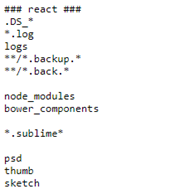

### Durum Kontrolü
Çalışma dizininde yapılan değişiklikleri görmek için kullanılır.
```git
git status
```

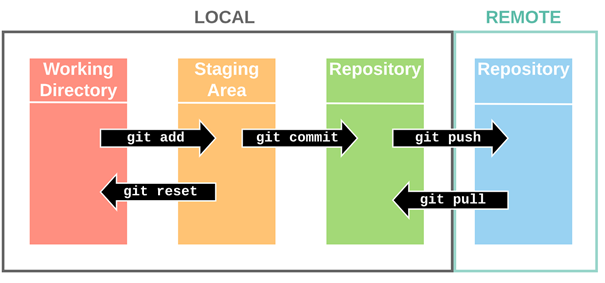

### Staging Area
Git tarafından dosyalarınızın commit edilebilir olmasını istiyorsanız staging area içerisine aktarmalısınız.
```git
git add fileName
```
Eğer tüm dosyaları eklemek isterseniz `.` kullanabilirsiniz.
```git
git add .
```
Staging Area içerisinde olan dosyanızı buradan çıkartmak için yani commit işlemine dahil edilmemesini istiyorsanız. Aşağıdaki komutu kullanabilirsiniz.
```git
git rm --cached fileName
```
### Commit İşlemi
Staging Area içerisinden Local Repository içerisine dosyaları aktarmak için commit işlemi gerçekleştirmeliyiz.
```git
git commit -m "first commit"
```
Yapılan commit işlemlerini listelemek için aşağıdaki komut kullanılabilir.
```git
git log
```
Daha basit bir çıktı almak isterseniz aşağıdaki gibi bir bayrak eklenebilir.
```git
git log --oneline
```
Eğer ağaç yapısında görmek isterseniz --graph bayrağını eklemelisiniz.
```git
git log --graph
```
#### Yanlış Commit Mesajı Düzenleme
Bu işlem için `--amend` bayrağı kullanılabilir. Yalnız HEAD ilgili commit üzerinde olmalıdır. Son commit için bu değişiklik yapılacaksa zaten problem olmayacaktır.
```git
git commit --amend -m "yeni mesaj"
```
#### Eksik Commit İşlemi
Eğer bir commit işleminde bir veya daha fazla dosyayı eklemeyi unutursanız bunun içinde `--amend` bayrağını kullanabilirsiniz.
İki dosyanız olsun. Bunlar `a.js` ve `b.js` şeklinde isimlendirilsin.
```git
touch a.js
touch b.js
```
Şimdi sadece bir tanesini staging area içerisine taşıyıp commit edelim.
```git
git add a.js
git commit -m "a.js created"
```
Bu aşamada `b.js` dosyasını commit etmeyi unuttuğumuz fark ettik. Bunun için unutulan dosyayı staging area içerisine alıyoruz.
```git
git add b.js
```
Şimdi burada commit işlemini `--amend` bayrağı ile gerçekleştireceğiz.
```git
git commit --amend -m "a.js and b.js created"
```
`NOT:` Eğer GIT sistemi ile VIM editör kullanıyorsanız aşağıdaki gibi ilerlenebilir.

Bu komuttan sonra daha önceki commit işlemi için oluşturulan yapıya editör odaklanacaktır. Düzenleme yapmak için `i` tuşuna basmalısınız. En üst taraftaki mesaj kısmını düzenleyip `ESC` tuşuna bastıktan sonra `:` tuşuna basıyoruz. Son olarak `w` ve `q` tuşuna basıyoruz.
```git
git log --oneline
```
Yukarıdaki kod ile işlemin tamamlanıp tamamlanmadığını kontrol edebilirsiniz.

## 3. GIT BRANCH
Proje sürecinde farklı ekipler farklı özellikler geliştiriyor olabilir ya da siz de asıl proje üzerinde bir güncelleme yapmadan feature ayrımı yaparak ilerlemek istiyor olabilirsiniz. Bu işlem için branchler kullanılmaktadır.
`NOT`: HEAD güncel olarak hangi branch ve hangi committe olduğumuz gösterir.
`NOT`: Git sistemi varsayılan olarak `MASTER` branch üzerinden ilerler ancak bunu son zamanlarda `MAIN` olarak adlandırmak istiyorlar.

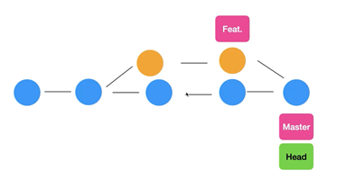

### Güncel Branch Bilgisi
Git sistemindeki branchleri listeler ve aktif olanı * ile işaretler.
```git
git branch
```
### Branch Oluşturma
Aşağıdaki komut Feat adında bir branch oluşturur.
```git
git branch Feat
```
### Branch Değiştirme
Oluşturulan branch'e geçiş yapmak için switch komutu kullanılır.
```git
git switch Feat
```
Ana branch'e geçmek için ana branch adını yazmak gerekmektedir.
```git
git switch MASTER
```
### Branch Birleştirme
Master branch ile Feat branch birleştirmek için aşağıdaki komut kullanılabilir.
```git
git merge Feat
```
### Fast Forwarding
`Master` branch üzerinde bir `değişiklik yapmadan` diğer branch üzerinde yapılan değişikleri master branch'e dahil etme işlemine `fast forwarding` denilmektedir. Özel bir komutu yok.

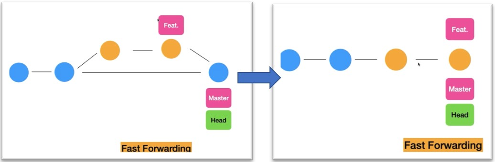

### Merge Conflict
Branch birleştirme işlemlerinde ya da aynı branch üzerinde farklı kişilerin yapmış olduğu değişiklikler çakışmaya sebebiyet verebilir. Bu aynı dosyanın aynı satırlarına müdahaleyle olabileceği gibi A kişisinin xyz dosyasını silmesi B kişisinin ise bu işlemi yapmaması gibi durumlar manuel olarak yönetilmesi gerekmektedir. GIT sistemini kurarken eğer VS Code gibi bir editörü varsayılan editör olarak bildirmediyseniz VIM editörde conflictleri yönetmenizi isteyecektir.

Ya da aşağıdaki gibi ilgili dosya içerisine git süreci yönet sonrasında tekrar commit yap diyecektir.

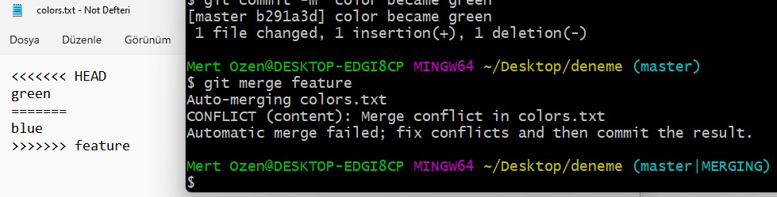

Yukarıdaki aşamaya gelebilmek için şu adımları tekrarlamanız gerekmektedir.
1. İlgili klasörde `git init` komutunu kullanın. Klasör içerisinde `colors.txt` dosyası oluşturup içine `red` yazın.
2. `git add .`
3. `commit -m "first commit"`
4. `git branch feature`
5. `git switch feature`
6. colors.txt dosyasınıdaki `red` yazısını silin ve `blue` yazın.
7. `git add .`
8. `git commit -m "color is blue"`
9. `git switch master`
10. colors.txt dosyasında `red` yazdığını göreceksiniz. Şimdi o satırı silip `green` yapın.
11. `git add .`
12. `git commit -m "color is green"`
13. `git merge feature` işleminden sonra yukarıdaki ekran görüntüsünde olduğu gibi conflict göreceksiniz.

Şimdi dosyada gördüğümüz ifadelere ve senaryolara gelelim.

1. `HEAD` olarak işaretlenmiş `green` satırı geçerli branch olan master branch'i ifade etmektedir. Eğer bu değişikliğin kabul edilmesini isterseniz aşağıdaki gibi dosyayı düzenleyip kaydedip commit işlemi yapmanız gerekecektir.

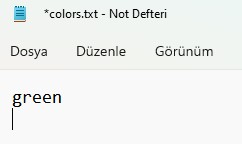

2. `feature` ile işaretlenmiş `blue` satırı diğer branch üzerinden gelen değişikliği ifade etmektedir. Eğer bu branch üzerinden gelen değişikliği kabul etmek istiyorsanız aşağıdaki gibi ilgili yerleri temizlemeniz ve kaydetmeniz gerekmektedir. Tabii sonrasında commit işlemi yapmanız gerekmektedir.

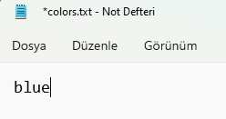

3. Her iki branch üzerinden gelen değişikleri kabul etmek istiyorda olabilirsiniz. Bu durumda aşağıdaki gibi dosyayı düzenleyip commit işlemi yapmalısınız.

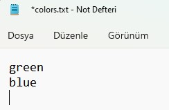

4. Son olarak bu değişikliklerin hiç birini kabul etmeyip o an yeni bir içerik eklemesi yapabilirsiniz. Ya da mevcutları da bırakıp üstüne birşeyler ekleyebilirsiniz.

### STASH
`Feature` branch üzerinde bir geliştirme yapıyorsunuz diyelim. Ancak henüz commit etmeye hazır değil. Yani işi bitirmediniz. Bu sırada sizden beklenen acil bir iş var ve diğer `master` branch'e geçip işi halledip kaldığınız yerden feature branch üzerinde işlem yapmaya devam edeceksiniz. İşte böyle bir durumda `stash` yapısını kullanabilirsiniz.

`NOT:` Eğer yaptığınız değişikleri commitlemeden önce geri almak isterseniz `git restore fileName` komutunu kullanabilirsiniz.

`git stash push`: mevcut branchteki değişikleri saklar.
`git stash list`: stash üzerinde bulunan kayıtları listeler.
`git stash pop`: stash'e atılan en son kaydı getirerek ilgili yerlere uygular ve listeden siler.
`git stash apply stash@{0}`: birden fazla kayıt arasından istediğimizi uygulayabiliriz.
`git stash clear`: stash üzerindeki tüm kayıtları silebiliriz
`git stash apply`: stash üzerindeki ilk kaydı getirir ve kayıt stash üzerinde kalmaya devam eder.

### Cherry Pick
Eğer `master branch` üzerindeyken yapmanız gereken bir değişiklik varken hangi branch üzerinde olduğunuza dikkat etmeyip `yanlış branch` içerisinde commit yaptınız diyelim bu durumda ne yapabilirsiniz?

Karşımıza `cherry-pick` komutu çıkıyor.

1. Commit'i yaptıktan sonra bir commitId verecektir. Bu id değerini kopyalayın.
2. `git checkout master`
3. `git cherry-pick commitId`
4. `git push origin master`

Yukarıdaki adımlar sonrasında yanlış branch üzerinde yapılan commit doğru branch üzerinde yapılmış oldu.

## 4. GEÇMİŞE DÖNME
Commit atmadan geri dönmek `restore` ile mümkün ancak commit attıktan sonra ne yapabiliriz?

### GIT Checkout
`git checkout commitId`: Head konumunu değiştirir. Mevcut konumda yeni bir commit ya da branch oluşturulup geçiş yapılabilir.

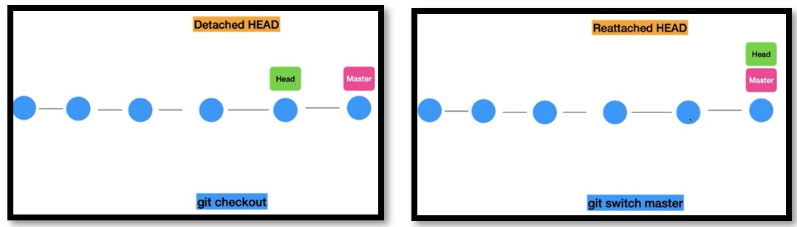

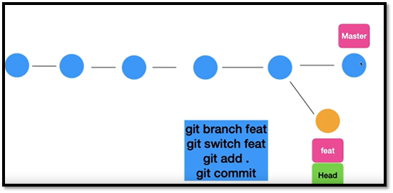

`NOT`: Checkout ile geri döndüğümüzde en son commit silinmiş olmuyor. Sadece gezinmiş oluyoruz. Ayrıca mevcut konumdan projeyi dallandırabiliyoruz.

### GIT Reset
`git reset commitId:` ID bilgisi verilen commite döner ve sonrasında gelen commitleri siler. Ancak commitlerle gelen değişikleri silmez onları bırakır.

`git reset --hard commitId:` ID bilgisi verilen commite döner sonrasında gelen commitleri ve değişikleri de siler.

`git reset --soft commitId:` ID bilgisi verilen commite döner sonrasındaki commitler staging area içerisine taşınır.

### GIT Revert
`git revert commitId:` GIT History içerisinde tutmak istediğiniz geri alma işlerinde kullanılır. Yani değişikler geri alınır ancak `git log` ile bakıldığında geri alınan commitler görüntülenebilir.

### GIT Diff
`git diff:`Staging Area içerisine alınmamış, güncel dosya içerisindeki değişikleri gösterir.
`git diff HEAD`: Son commit'e göre yapılan değişikleri gösterir.
`git diff commitId1 commitId2`: İki commit arasındaki farklılıkları gösterir.
`git diff branchname1 branchname2`: İki branch arasındaki farklılıkları gösterir.

### GIT Rebase
`git rebase master`: GIT History içerisini daha temiz tutmak için yani merge commitlerden kurtulmak için kullanılabilir.

`NOT:`Master haricindeki bir branch içerisindeyken GIT Reabase komutu çalıştırılmalıdır. GIT Reabase komutu GIT tarihi ve GIT loglarını değiştirdiği için takım çalışmasında problem olabilir. Eğer oluşturulan yapılar daha önce paylaşılmadıysa ve ilk defa paylaşılacaksa GIT Reabase komutu kullanılabilir.

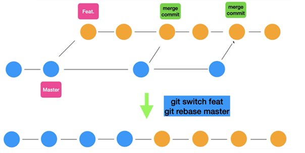

## 5. REMOTE REPOSITORY (GITHUB vb.)
Yukarıda anlatılanların tamamı local repo üzerinde gerçekleştirdiğimiz işlemlerdi. Takım çalışmasında remote repo ile işlem yapmamız gerekmektedir. Aşağıdakiler yukarıdakilere ek bilgilerdir.

`NOT:` Remote Repo Github, Gitlab gibi sistemler olmak zorunda değildir. Şirket kendi içerisinde bir GIT sunucusu oluşturmuş olabilir.

Başka bir projeyi kendi lokalinize indirmek için `git clone` komutunu kullanabilirsiniz.

```git
git clone https://github.com/username/reponame.git
```

`NOT:` Clone işlemi remote repodaki git yapısını bütünüyle indirdiği için değişikleri push ile göndermek istediğinizde yetkiniz yoksa problem yaşarsınız. Clone yaptığınız projedeki gizli `.git` dosyasını silerseniz remote repo ile bağı kalmayacaktır. Sonrasında `git init` ile kendi git sistemini projeye bağlayabilirsiniz.

Bir diğer yöntemde projeyi kendi github hesabına `fork` yapıp oradan clone yapmak olacaktır.

```git
git remote add origin https://github.com/username/reponame.git
```

Yukarıdaki komut remote repoyu localdeki git sistemine tanıtmak için kullanılmaktadır. ORIGIN ifadesi tekrar tekrar aynı URL'yi yazmamak için tanımlanan bir ifadedir.

Branch bildirmek için kullanılmaktadır. Yani master branch olarak ifade ettiğimiz yapıyı main olarak adlandırıyoruz. Bu işlem yapılmayabilir de yani varsayılan olarak master şeklinde de kalabilir.

```git
git branch -M main
```
Aşağıdaki komut ile local repodaki bilgileri remote repoya aktarmak için kullanırız. Buradaki `-u` ifadesi `origin` olarak bildirilen URL'ye varsayılan olarak gönderileceğini ifade eder. Sonrasındaki commitler için `git push` demek yeterli olacaktır. Ayrıca main branch'e push edilecektir.

```git
git push -u origin main
```

Direkt olarak local repoyu etkilemeden yani değişikleri uygulamadan remote repodan değişikleri çekmek istersek aşağıdaki gibi `fetch` komutundan faydalanabiliriz. Bu sayede main branch remote repodan gelir ve `git status` komutu ile mevcut durum kontrol edilebilir.

```git
git fetch origin main
```

Aşağıdaki komut ile remote repo üzerinde bulunan branchler listelenir.

```git
git branch -r
```

Eğer remote repodan değişikleri hem al (fetch) hem de merge et demek istersek aşağıdaki komutu kullanabiliriz.

```git
git pull origin main
```

Tabi tek branch varsa sadece `git pull` demek yeterli olacaktır.


